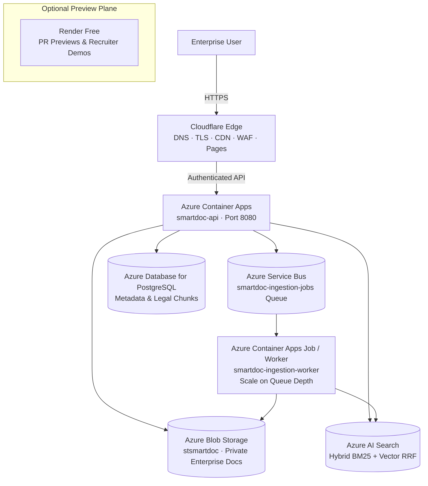

# System Architecture: SmartDocument

## 1. Business Problem & Mission

In enterprise organizations, knowledge is trapped across fragmented SOPs, legal policies, supplier contracts, and technical documentation. Employees spend hours manually skimming dense PDFs, risking costly non-compliance or outdated decisions:

```
[Employee Question]
         │
         ▼
[Query Normalization & Structure Extraction] (Detect "Điều N", clause numbers, document codes)
         │
         ▼
[Hybrid Retrieval: BM25 + Vector RRF] (Azure AI Search / Qdrant)
         │
         ▼
[Confidence Gate & Corrective RAG (CRAG)] (Score >= 0.3 threshold)
         │
         ├── Low Confidence (< 0.3) ──► [Honest Refusal / Query Reformulation]
         │
         └── High Confidence (>= 0.3) ─► [Generation with Exact Citations [S1], [S2]]
```

**Core Engineering Promise:**
> *"I can build production-oriented AI applications that retrieve verified evidence from governed enterprise documents."*

---

## 2. Clean Architecture Layering

SmartDocument enforces strict boundary separation between business rules and external cloud services:

```
Domain  ◄──  Application  ◄──  Infrastructure  ◄──  Presentation
```

| Layer | Packages / Modules | Responsibilities |
|---|---|---|
| **Domain** | `entity/`, `repository/` | `Document`, `LegalChunk`, `DocumentIngestionJob`, `AuditLog`. Zero third-party SDK dependencies. |
| **Application** | `service/` | `RetrievalService`, `ChatService`, `DocumentJobService`, `QueryReformulator`. Pure business logic & ports. |
| **Infrastructure** | `service/StorageService.java`, `agent/tools/qdrant_tool.py`, `infra/` | Adapters: Azure Blob Storage, Cloudflare R2, Azure AI Search, Azure Service Bus, PostgreSQL. |
| **Presentation** | `controller/`, `frontend/` | Spring Boot REST endpoints, SSE streaming managers, React Vite frontend on Cloudflare Pages. |

---

## 3. Hybrid-Cloud Infrastructure Architecture



### Dual Deployment Profiles

| Component | `PROFILE=portfolio` (Demo) | `PROFILE=production` (Azure Enterprise) |
|---|---|---|
| **API Compute** | Render Web Service ($0 tier) | Azure Container Apps (`min_replicas = 0`, scale-to-zero) |
| **Ingestion Worker** | In-process daemon / local thread pool | Azure Container App Worker scaling via KEDA on Service Bus |
| **Document Storage** | Cloudflare R2 ($0 egress) / local storage | Azure Blob Storage (`enterprise-documents`, SSE AES-256) |
| **Vector & Search Engine** | Qdrant Cloud Free / In-process BM25 | Azure AI Search (Basic SKU, native BM25 + dense vector RRF) |
| **Message Queue** | In-memory job queue / SQLite | Azure Service Bus (`smartdoc-ingestion-jobs`, dead-letter DLQ) |
| **Secrets & Identity** | `.env` file | Azure Key Vault + User-Assigned Managed Identity |

---

## 4. Architectural Decision Records (ADRs)

1. [ADR-0005: Azure AI Search vs Qdrant](file:///Users/mainguyenbinhtan/Downloads/TMA/Smart-Document-Chatbot/docs/adr/0005-azure-ai-search-vs-qdrant.md) — Pluggable retrieval provider: Qdrant for developer demo, Azure AI Search for production managed hybrid BM25 + vector fusion.
2. [ADR-0006: Azure Blob Storage vs Cloudflare R2](file:///Users/mainguyenbinhtan/Downloads/TMA/Smart-Document-Chatbot/docs/adr/0006-blob-vs-r2.md) — Private Azure Blob Storage with SAS tokens protects internal docs; Cloudflare R2 used for public demo assets.
3. [ADR-0007: Why Container Apps instead of AKS](file:///Users/mainguyenbinhtan/Downloads/TMA/Smart-Document-Chatbot/docs/adr/0007-why-container-apps-not-aks.md) — Serverless container compute eliminates idle cluster waste while maintaining container portability.
4. [ADR-0008: Why Azure Service Bus over Kafka](file:///Users/mainguyenbinhtan/Downloads/TMA/Smart-Document-Chatbot/docs/adr/0008-why-service-bus-not-kafka.md) — Durable job delivery, built-in deduplication, and dead-letter queues without cluster management overhead.
5. [ADR-0009: Render Preview Environment](file:///Users/mainguyenbinhtan/Downloads/TMA/Smart-Document-Chatbot/docs/adr/0009-render-preview-environment.md) — Zero-cost ephemeral demo environment without false high-availability claims.
