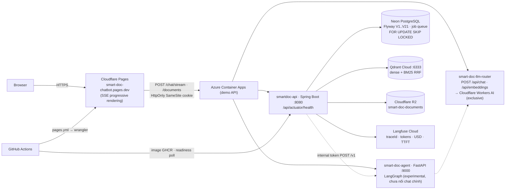
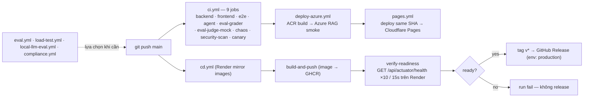
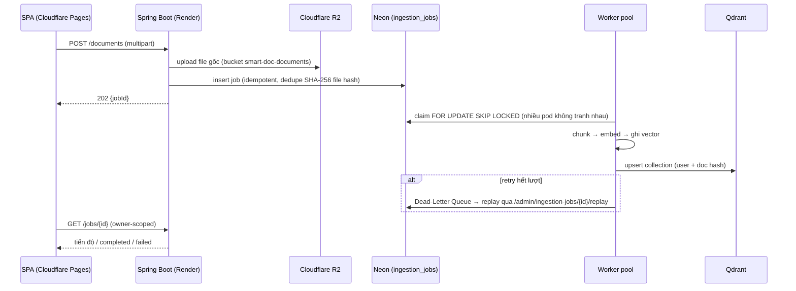
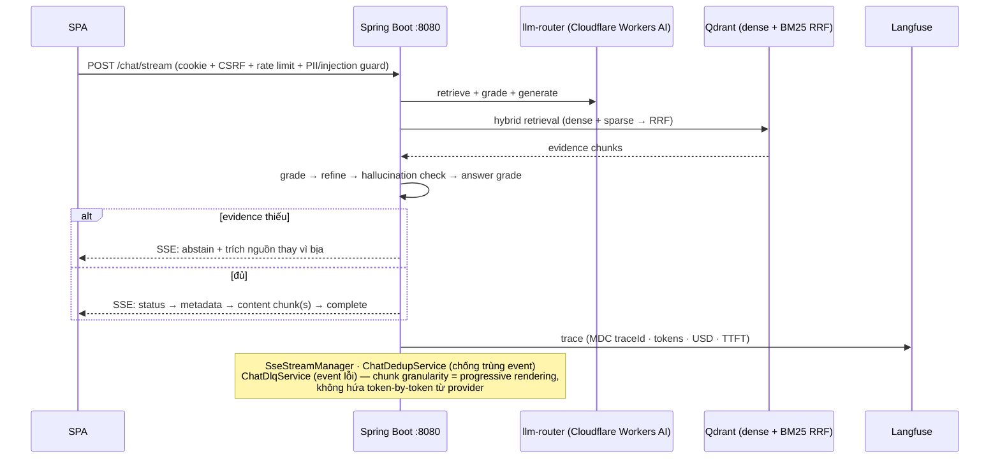
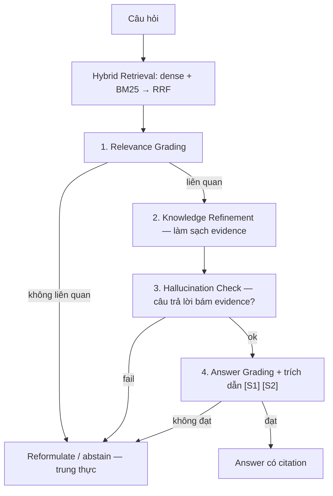
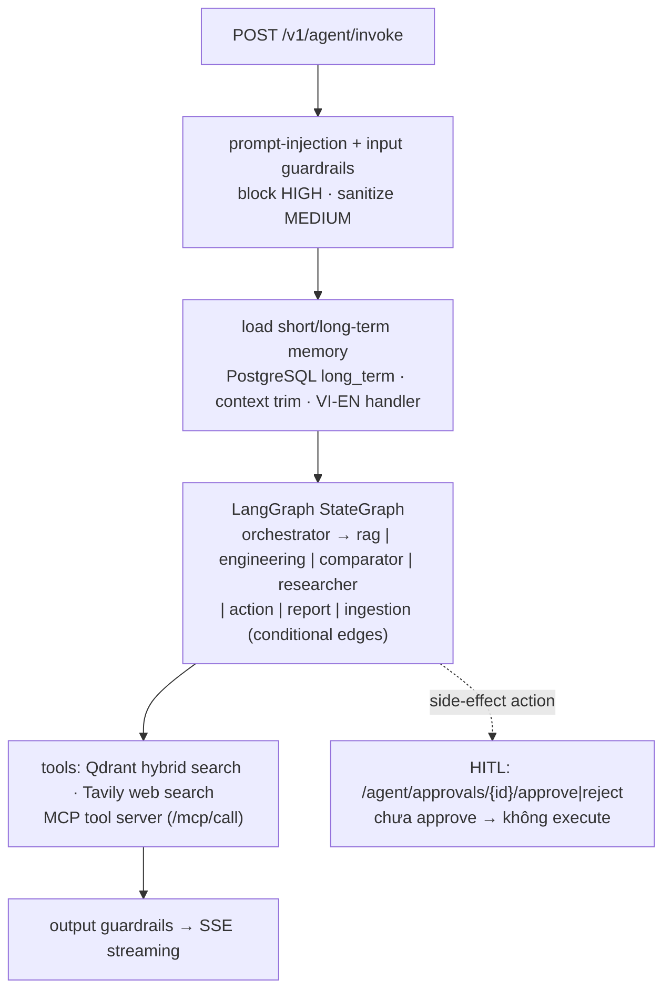

# System Architecture: Smart-Document-Chatbot

> Bản đồ kiến trúc Smart-Document-Chatbot: **service map → hạ tầng cloud (verified) → DevOps →
> luồng API → luồng AI/agent**. Trạng thái production trung thực: `README.md` → *Production status*;
> deploy: `docs/DEPLOYMENT.md`; agent riêng: `docs/agent_architecture.md`; quyết định: `docs/adr/`.

## 1. Business Problem & Mission

Doanh nghiệp mắc kẹt giữa SOP, hợp đồng, chính sách pháp lý phân mảnh. Người dùng hỏi tự nhiên
(tiếng Việt/Anh) → hệ thống **trích nguồn, trích dẫn điều khoản, biết từ chối khi thiếu bằng chứng**
thay vì bịa. Trí nhớ nằm ở **Corrective RAG 5 lớp**, không nằm ở prompt:

```text
[Câu hỏi của người dùng]
         │
         ▼
[Chuẩn hoá truy vấn — bắt "Điều N", mã tài liệu, số clause]
         │
         ▼
[Hybrid Retrieval: dense vector + BM25 sparse, hợp nhất qua RRF]
         │
         ▼
[Corrective RAG 5 lớp: grade → refine → hallucination check → answer grade]
         │
         ├── evidence < ngưỡng ──► [Abstain / reformulate — trung thực]
         │
         └── evidence đủ ──► [Generate có trích dẫn [S1], [S2]]
```

**Core engineering promise:** *"Tôi xây được ứng dụng AI doanh nghiệp trả lời từ bằng chứng đã kiểm
chứng — mỗi câu trả lời quy về được đoạn nguồn cụ thể, và biết nói 'không đủ căn cứ'."*

## 2. Service map (hiện trạng — code thật)

| Service | Tech | Port | Vai trò | Chạy ở đâu |
|---|---|---|---|---|
| SPA | React 18 + TypeScript (Vite) | — | chat UI, SSE progressive rendering, upload | **Prod: Cloudflare Pages** `https://smart-doc-chatbot.pages.dev` (workflow `pages.yml`) |
| `smartdoc-backend` | **Spring Boot 3.2 / Java 17** | **8080** | auth (HttpOnly cookie), document CRUD, job queue, chat CRAG + SSE, audit | **Azure demo API** `https://smartdoc-api.blackisland-5a3f0246.southeastasia.azurecontainerapps.io`, RAG live smoke pass 2026-10-09; Render `2hhz` là mirror đang trả 502 gián đoạn |
| `smart-doc-agent` | Python FastAPI + **LangGraph** | **9000** | multi-agent: `/v1/*` và root — `/agent/invoke`, `/agent/invoke-stream`, `/agent/approvals` (HITL Redis-backed, fail-closed, snapshot resume — approve khôi phục đúng state lúc pause, không chạy lại từ đầu), `/a2a/*`, `/mcp/*`, `/agent/memory/graph`, `/training-jobs`, `/health`, `/ready`, `/metrics` — **đã nối vào luồng chat chính**: backend `ChatService` (mode `agent`, mặc định) gọi `/v1/agent/invoke` qua `AgentClient`, HITL pause (`hitl_pending`/`hitl_approval_id`) propagate qua `ChatResponse`/SSE metadata, duyệt tại `/agent/approvals/**` (ADMIN/ENGINEER) | Render `smart-doc-agent` (+ `AGENT_BASE_URL` trỏ từ backend); compose `agent` + `redis`; k8s `25-smartdoc-agent` + `16-redis` |
| `smart-doc-llm-router` | FastAPI | — | `POST /api/chat`, `POST /api/embeddings` → **Cloudflare Workers AI exclusively** (service này không fallback Ollama), `GET /health/live` | Render `smart-doc-llm-router` |
| `smartdoc-keycloak` | Docker | 8080 | OIDC (optional) | Render |
| DB | **Neon PostgreSQL** | 5432 | Flyway `V1..V21`: users/permissions, document metadata, legal chunks, **ingestion jobs** (`FOR UPDATE SKIP LOCKED`, DLQ) | managed |
| Vector | **Qdrant Cloud** | 6333 | HNSW cosine; hybrid dense+BM25 qua RRF | managed |
| Blob | **Cloudflare R2** | — | bucket `smart-doc-documents` (file gốc) | managed |
| Tracing | **Langfuse Cloud** | — | token/USD cost, TTFT, span LLM, MDC `traceId` | managed |

## 3. Hạ tầng cloud (verified) — đường request thật



**Trạng thái trung thực (README → Production status):** SPA đang sống trên Pages; backend Azure đã qua RAG smoke;
`2hhz` Render đang 502 gián đoạn; `h4mt` legacy chưa xác nhận; LLM router/Keycloak từng down do
free-tier — đúng sự thật thay vì trích link chết. Repo variable/secrets: `RENDER_API_KEY`,
`RENDER_SERVICE_ID`, `CLOUDFLARE_API_TOKEN`, `CLOUDFLARE_ACCOUNT_ID`.

## 4. DevOps / CI-CD (workflow thật trong `.github/workflows/`)

| Workflow | Trigger | Jobs | Gate / kết quả |
|---|---|---|---|
| `ci.yml` | push, PR | `backend-test` · `frontend-test` · `frontend-e2e` · `agent-test` · `eval-grader` · `eval-llm-judge-mock` · `chaos-test` · `security-scan` · `canary-smoke` | 9 gate: unit Java/TS/Python, e2e, eval regression, chaos, scan, smoke |
| `eval.yml` | push, PR, dispatch | `fixture-smoke` · `live-benchmark` · `e2e-fullstack` | benchmark Hit@K/Recall@K/MRR — regression là fail |
| `cd.yml` | push `main` (+ tag) | `build-and-push` → **`verify-readiness`** (`render-readiness.yml`, health `/api/actuator/health`, 10×15s) → `release` (tag `v*` → GitHub Release, environment `production`) | readiness không qua = chưa release |
| `pages.yml` | Azure RAG deploy success, dispatch | `deploy-pages` → Cloudflare Pages | tải artifact SHA từ Azure run; frontend lên Pages và xác minh đúng revision |
| `deploy-azure.yml` | CI success trên `main`, dispatch | `test-and-deploy` | ACR build cùng source SHA → Azure API → readiness + browser CORS/cookie + RAG smoke; thiếu credential → FAIL; agent readiness báo riêng |
| `compliance.yml` | `workflow_run`, schedule, dispatch | `verify-staging` | kiểm tra định kỳ |
| `load-test.yml` | schedule (nightly), dispatch | `load-test` | tải đêm |
| `local-llm-eval.yml` | schedule, dispatch | `ollama-eval` | eval LLM local trong CI |
| `render-readiness.yml` | `workflow_call` | `poll` | reusable readiness (dùng bởi `cd.yml`) |



## 5. Luồng API end-to-end

### Endpoint map chính (Spring Boot `:8080` — chi tiết: `docs/API.md`)

| Nhóm | Method + Path | Ghi chú |
|---|---|---|
| Auth | `POST /auth/register` · `POST /auth/login` · `POST /auth/logout` · `GET /auth/me` · `POST /auth/reset-password/request` · `POST /auth/reset-password/confirm` · `GET /auth/google-client-id` · `POST /auth/google` | HttpOnly SameSite cookie (không localStorage), reset token SHA-256 single-use, `GET /csrf` |
| Chat | `POST /chat` · `POST /chat/ask` · `POST /chat/stream` (alias `/chat/ask-stream`, SSE) · `GET /chat/history/{sessionId}` · `GET /chat/sessions` | SSE sequence: `status → metadata → content chunk(s) → complete` (hoặc `error`) |
| Documents | `POST /documents` (alias `/upload`) · `GET /documents/{id}` · `GET /documents/{id}/legal-chunks` · `GET /documents/search` · `POST /documents/search` · `PUT /documents/{id}` · `DELETE /documents/{id}` · `DELETE /documents/batch` · `GET /documents/{id}/versions[/{n}]` | `POST /documents` trả `jobId` — không đồng bộ hoá request |
| Jobs | `GET /jobs/{id}` | owner-scoped, poll tiến độ ingestion |
| Search | `GET /search` · `POST /search` | hybrid search API |
| Agent bridge | `POST /api/agent/invoke` | Spring → agent service (internal token) |
| Admin | `GET /admin/audit-logs` · `POST /admin/ingestion-jobs/{id}/replay` | audit + replay DLQ |

Agent service (FastAPI `:9000`, mount hai lần: `/v1/*` và root): `POST /agent/invoke` ·
`POST /agent/invoke-stream` · `/agent/approvals` (HITL: GET list, POST `/{id}/approve|reject`) ·
`/a2a/agents|delegate|stats` · `/mcp/info|tools|call|stats` · `/agent/memory/graph/*` ·
`/agent/connector/ingest` (internal token) · `/training-jobs*` (internal token) ·
`POST /agent/documents/{id}/purge` (internal token, Phase 2 — backend gọi sau khi xóa tài
liệu: dưới collection/points Qdrant của document, xóa cache retrieval trong Redis và
tombstone memory trỏ tới document) · `/health`, `/ready`, `/metrics`.

### Sequence A — nạp tài liệu (async, durable — ADR-0004)



### Sequence B — hỏi đáp SSE qua Corrective RAG



## 6. Luồng AI agent / LLM

### Đường sản phẩm chính (Spring CRAG — đã nối, đang chạy)



- **Agent-first routing:** truy vấn mặc định đi Agent (LangGraph multi-step), RAG là fallback —
  *agent suy luận, RAG truy xuất*, mỗi thứ có làn của nó.
- **LLM sources:** đường chat chính dùng `llm-router` → **Cloudflare Workers AI exclusively**
  (service này không fallback Ollama); agent service chạy **local-first Ollama** với fallback theo
  `agent/settings.py`. Observability qua **Langfuse** (tokens, USD, TTFT) + MDC `traceId`.

### Đường thử nghiệm (Python agent — CHƯA nối vào chat chính)



- Chi tiết từng thành phần, connector ingestion (`POST /v1/agent/connector/ingest`), eval framework và
  ranh giới ADK/A2A/MCP-tùy-chỉnh: **`docs/agent_architecture.md`**.
- Eval là gate: `eval/run_fixture_eval.py` (smoke trong CI) + `eval/run_live_benchmark.py`
  (Hit@K, Recall@K, MRR — regression = fail).

## 7. Clean Architecture Layering & dual profile

```
Domain  ◄──  Application  ◄──  Infrastructure  ◄──  Presentation
```

| Layer | Packages | Responsibilities |
|---|---|---|
| **Domain** | `entity/`, `repository/` | `Document`, `LegalChunk`, `DocumentIngestionJob`, `AuditLog` — zero third-party SDK |
| **Application** | `service/` | `RetrievalService`, `ChatService`, `DocumentJobService`, `QueryReformulator` |
| **Infrastructure** | `service/StorageService.java`, `agent/tools/qdrant_tool.py`, `infra/` | R2/Blob, search, queue, PostgreSQL adapters |
| **Presentation** | `controller/`, `frontend/` | REST + SSE controllers, React Vite SPA |

### Dual deployment profiles (bảng thiết kế — hiện trạng verified ở mục 3)

| Component | `PROFILE=portfolio` (đang chạy) | `PROFILE=production` (Azure enterprise — mục tiêu) |
|---|---|---|
| API Compute | Render Web Service ($0 tier) | Azure Container Apps (`min_replicas=0`, scale-to-zero) |
| Ingestion Worker | DB-backed queue + in-process worker | ACA Job / KEDA scale trên Service Bus queue depth |
| Document Storage | Cloudflare R2 (`smart-doc-documents`) | Azure Blob (`enterprise-documents`, SSE AES-256) |
| Vector & Search | Qdrant Cloud (HNSW cosine, hybrid RRF) | Azure AI Search (BM25 + vector fusion) |
| Message Queue | Neon job table (`FOR UPDATE SKIP LOCKED`) + DLQ | Azure Service Bus + DLQ |
| Secrets & Identity | env / dashboard secrets | Azure Key Vault + User-Assigned Managed Identity |

## 8. Architectural Decision Records (ADRs)

1. [ADR-0005: Azure AI Search vs Qdrant](adr/0005-azure-ai-search-vs-qdrant.md) — retrieval pluggable: Qdrant cho demo, Azure AI Search cho production managed hybrid.
2. [ADR-0006: Azure Blob vs Cloudflare R2](adr/0006-blob-vs-r2.md) — tài liệu nội bộ private (SAS), R2 cho asset demo.
3. [ADR-0007: Container Apps thay vì AKS](adr/0007-why-container-apps-not-aks.md) — serverless container, không phí cluster idle.
4. [ADR-0008: Service Bus thay vì Kafka](adr/0008-why-service-bus-not-kafka.md) — durable delivery + dedup + DLQ không cần quản cluster.
5. [ADR-0009: Render Preview Environment](adr/0009-render-preview-environment.md) — demo ephemeral $0, không claim HA giả.
6. [ADR-0004: Durable ingestion job queue](adr/0004-durable-ingestion-job-queue.md) — `FOR UPDATE SKIP LOCKED` + DLQ thay vì queue in-memory.
7. [ADR-0003: Agent fallback strategy](adr/0003-agent-fallback-strategy.md) · [ADR-0002: supply-chain routing](adr/0002-supply-chain-routing.md) · [ADR-0001: security boundaries](adr/0001-security-boundaries.md) · [ADR-0010: SSO deferred](adr/0010-sso-deferred.md).

## 9. Tài liệu liên quan

- Trạng thái production trung thực: `README.md` → *Production status* (URL nào sống/suspended)
- API chi tiết: `docs/API.md` · Deploy: `docs/DEPLOYMENT.md`, `docs/DEPLOYMENT_LOCAL_FIRST.md`
- Agent: `docs/agent_architecture.md` · Eval: `docs/EVALUATION.md` · Observability: `docs/OBSERVABILITY.md`, `docs/LANGFUSE_INTEGRATION.md`
- Threat model: `docs/threat-model.md` · Security: `docs/security.md`


